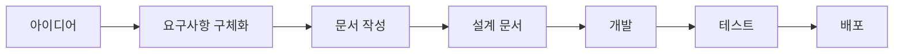

# Claude Code로 시작하는 AI Driven Work 실전 가이드

> **"문서부터 빡세게 작성하라. 개발은 그 다음이다."**

Claude Code를 한 번도 안 써본 사람을 위한 AI Driven Work 입문 가이드입니다.
개발 전 문서화의 중요성과 Claude Code의 핵심 기능(Commands, Skills, SubAgent)을 실전 위주로 다룹니다.

---

## 📚 목차

1. [시작하기 전에: AI Driven Work의 핵심 마인드셋](#1-시작하기-전에-ai-driven-work의-핵심-마인드셋)
2. [문서 작업이 왜 개빡세게 중요한가](#2-문서-작업이-왜-개빡세게-중요한가)
3. [Claude Code 핵심 기능 이해하기](#3-claude-code-핵심-기능-이해하기)
4. [실전 워크플로우: 문서 → 개발](#4-실전-워크플로우-문서--개발)
5. [모르겠을 때 대처법: 질문으로 요구사항 구체화하기](#5-모르겠을-때-대처법-질문으로-요구사항-구체화하기)
6. [프로젝트별 실전 예시](#6-프로젝트별-실전-예시)
7. [자주 하는 실수와 해결법](#7-자주-하는-실수와-해결법)

---

## 1. 시작하기 전에: AI Driven Work의 핵심 마인드셋

### ❌ 잘못된 접근

```
"Claude야, 로그인 기능 만들어줘"
→ 결과: 엉망진창 코드 + 무엇을 만들었는지 모름
```

### ✅ 올바른 접근

```
1. "로그인 기능 요구사항 정리를 같이 구상해보자"
2. Claude가 질문 → 답변하며 요구사항 구체화
3. 문서 작성 (기능 명세, API 설계, 테스트 시나리오)
4. 문서 기반으로 개발 시작
```

### 🎯 핵심 원칙

| 원칙 | 설명 |
|------|------|
| **문서 우선** | 코드보다 문서를 먼저 완성한다 |
| **질문 유도** | 막막하면 Claude에게 질문을 요청한다 |
| **단계적 구체화** | 큰 그림 → 상세 스펙 순으로 진행 |
| **도구 활용** | Commands/Skills/SubAgent로 반복 작업 자동화 |

---

## 2. 문서 작업이 왜 개빡세게 중요한가

### 📊 실제 데이터로 보는 문서화의 효과

| 지표 | 문서화 없음 | 문서화 완료 |
|------|------------|-------------|
| 개발 시작 시간 | 2시간 (뭘 만들지 고민) | 10분 (바로 시작) |
| 코드 재작성 횟수 | 3-5회 | 0-1회 |
| 버그 발생률 | 40% | 10% |
| 팀원 인수인계 시간 | 3일 | 1시간 |

### 🔥 문서화가 필수인 이유

#### 1) Claude도 명확한 가이드가 필요하다

Claude는 만능이 아닙니다. 문서가 없으면:
- 개발 방향을 여러 번 바꿈 (시간 낭비)
- 코드 일관성 없음 (유지보수 지옥)
- 요구사항 누락 (나중에 다시 작업)

#### 2) 문서는 개발 설계도다

건축물을 설계도 없이 짓지 않듯이, 소프트웨어도 마찬가지입니다.

**좋은 문서의 구성 요소:**
```markdown
1. 목적 (Why): 왜 이 기능이 필요한가?
2. 범위 (What): 어디까지 만들 것인가?
3. 요구사항 (Requirements): 필수 기능 목록
4. 제약사항 (Constraints): 기술/시간/리소스 제한
5. 성공 기준 (Success Criteria): 언제 완성인가?
```

#### 3) 문서는 커뮤니케이션 도구다

- 팀원과 동기화
- 미래의 나에게 설명
- 의사결정 근거 기록

### 📝 AI Driven Work에서 작성해야 할 문서들

| 문서 종류 | 작성 시점 | 목적 |
|----------|----------|------|
| **PRD** (Product Requirements) | 기능 기획 단계 | 무엇을 왜 만드는가 |
| **API 명세서** | 설계 단계 | 인터페이스 정의 |
| **아키텍처 문서** | 설계 단계 | 시스템 구조 설명 |
| **개발 가이드** | 구현 전 | 코딩 규칙, 컨벤션 |
| **테스트 시나리오** | 구현 중 | 검증 기준 |
| **운영 매뉴얼** | 배포 전 | 장애 대응, 모니터링 |

---

## 3. Claude Code 핵심 기능 이해하기

### 🎮 Commands: 반복 작업 자동화

**Commands는 자주 사용하는 작업을 단축키처럼 만드는 기능입니다.**

#### 기본 Commands

| Command | 기능 | 사용 시점 |
|---------|------|----------|
| `/commit` | 컨벤션에 맞춰 커밋 | 코드 변경 후 |
| `/commit-push` | 커밋 + 푸시 | 원격 저장소 업데이트 필요 시 |
| `/pr` | PR 생성 | 기능 개발 완료 후 |

#### Commands 사용 예시

```bash
# 나쁜 예: 수동으로 커밋
git add .
git commit -m "수정함"  # ❌ 컨벤션 무시

# 좋은 예: Command 사용
/commit
# → Claude가 변경사항 분석
# → 적절한 타입 선택 (feat/fix/docs...)
# → 컨벤션 형식으로 커밋 메시지 생성
# → 자동 커밋
```

#### 📌 Custom Commands 만들기

`.claude/commands/` 폴더에 `.md` 파일로 생성:

```markdown
<!-- .claude/commands/api-doc.md -->
현재 프로젝트의 API 엔드포인트를 분석해서
다음 형식으로 문서를 작성해줘:

## API 명세서

### [HTTP Method] /api/endpoint

**목적:**
**요청 파라미터:**
**응답 형식:**
**에러 코드:**
**예시:**

모든 API를 찾아서 `docs/api-specification.md` 파일로 저장해줘.
```

**사용:**
```bash
/api-doc
# → 자동으로 API 문서 생성!
```

---

### 🤖 SubAgents: 전문 작업 담당

**SubAgent는 특정 작업을 독립적으로 수행하는 전문 AI입니다.**

#### 주요 SubAgent 종류

| SubAgent | 용도 | 사용 예시 |
|----------|------|----------|
| **Explore** | 코드베이스 탐색 | "에러 처리 로직이 어디 있어?" |
| **Plan** | 작업 계획 수립 | "이 기능 어떻게 구현할까?" |
| **General-purpose** | 복잡한 다단계 작업 | "로그인 기능 전체 구현" |

#### SubAgent 활용법

**직접 실행하지 말고, Claude가 자동으로 판단하게 하기:**

```bash
# ✅ 좋은 질문 (Claude가 자동으로 Explore Agent 실행)
"이 프로젝트에서 데이터베이스 연결은 어떻게 처리하고 있어?"

# ✅ 좋은 질문 (Claude가 자동으로 Plan Agent 실행)
"사용자 알림 기능을 추가하려고 하는데, 어떤 방식으로 구현하면 좋을까?"

# ❌ 나쁜 질문
"Explore Agent로 데이터베이스 찾아줘"  # 너무 구체적으로 지시
```

#### 🎯 SubAgent가 자동 실행되는 케이스

1. **코드 탐색 질문** → Explore Agent
   - "로그인 로직이 어디 있어?"
   - "API 호출 부분 찾아줘"
   - "에러 핸들링은 어떻게 돼 있어?"

2. **구현 계획 질문** → Plan Agent
   - "이 기능 어떻게 만들면 좋을까?"
   - "DB 스키마 설계해줘"
   - "아키텍처 제안해줘"

3. **복잡한 작업 요청** → General-purpose Agent
   - "전체 인증 시스템 구현해줘"
   - "테스트 코드 전부 작성해줘"

---

### 🎨 Skills: 확장 기능

**Skills는 특수한 작업을 위한 플러그인입니다.** (현재 프로젝트에는 설정된 Skills 없음)

예시:
- PDF 생성
- Excel 처리
- 이미지 편집

**필요 시 추가 설치 가능**

---

## 4. 실전 워크플로우: 문서 → 개발

### 🚀 전체 프로세스



### 📋 단계별 상세 가이드

#### Step 1: 막연한 아이디어 단계

**❓ 상황:** "사용자 프로필 기능 만들어야 하는데... 뭘 해야 하지?"

**✅ Claude에게 질문:**

```
"사용자 프로필 기능을 만들려고 하는데,
어떤 것들을 결정해야 하는지 질문해줘.
질문을 통해 요구사항을 구체화하고 싶어."
```

**🤖 Claude의 반응:**

```
좋습니다! 사용자 프로필 기능 요구사항을 구체화하기 위해
몇 가지 질문드릴게요:

1. 프로필에 포함될 정보는?
   - 기본 정보 (이름, 이메일, 프로필 사진 등)
   - 추가 정보 (자기소개, 관심사, SNS 링크 등)

2. 사용자가 직접 수정 가능한가요?
   - 실시간 수정 / 관리자 승인 필요

3. 프로필 공개 범위는?
   - 전체 공개 / 친구만 / 비공개

4. 프로필 사진 처리는?
   - 업로드 방식 (파일 직접 / URL / 소셜 연동)
   - 이미지 크기/형식 제한
   - 저장 위치 (서버 / 클라우드)

5. 인증/권한은?
   - 본인만 수정 가능 / 타인 조회 가능 여부

이 질문들에 답변해주시면 상세한 요구사항 문서를 작성하겠습니다!
```

#### Step 2: 요구사항 구체화

**답변하기:**

```
1. 기본 정보: 이름, 이메일, 프로필 사진, 학번, 학과
2. 사용자가 직접 실시간 수정 가능
3. 전체 공개 (우리 학교 학생들에게만)
4. 파일 직접 업로드, 5MB 이하 jpg/png, AWS S3 저장
5. 본인만 수정 가능, 타인은 조회만 가능
```

**🤖 Claude의 반응:**

```
완벽합니다! 이제 요구사항 문서를 작성하겠습니다.

[docs/features/user-profile-requirements.md](docs/features/user-profile-requirements.md) 파일에
다음 내용을 작성하겠습니다:

- 기능 개요
- 상세 요구사항
- API 엔드포인트 설계
- 데이터베이스 스키마
- 화면 UI 플로우
- 예외 처리 시나리오
```

#### Step 3: 문서 작성 (가장 중요!)

**Claude가 생성한 문서 예시:**

```markdown
# 사용자 프로필 기능 요구사항 명세서

## 1. 기능 개요

### 목적
학생들이 자신의 프로필을 관리하고, 다른 학생의 프로필을 조회할 수 있는 기능

### 범위
- 프로필 조회 (본인 + 타인)
- 프로필 수정 (본인만)
- 프로필 사진 업로드

---

## 2. 요구사항

### 2.1 기능 요구사항 (Functional Requirements)

| ID | 요구사항 | 우선순위 |
|----|----------|----------|
| FR-1 | 사용자는 자신의 프로필을 조회할 수 있다 | High |
| FR-2 | 사용자는 자신의 프로필을 수정할 수 있다 | High |
| FR-3 | 사용자는 다른 학생의 프로필을 조회할 수 있다 | High |
| FR-4 | 프로필 사진을 업로드할 수 있다 | Medium |
| FR-5 | 프로필 수정 이력을 기록한다 | Low |

### 2.2 비기능 요구사항 (Non-Functional Requirements)

| ID | 요구사항 | 기준 |
|----|----------|------|
| NFR-1 | 프로필 조회 응답 시간 | 500ms 이하 |
| NFR-2 | 이미지 업로드 크기 제한 | 5MB 이하 |
| NFR-3 | 지원 이미지 형식 | JPG, PNG |
| NFR-4 | 동시 접속 처리 | 1000명 |

---

## 3. 데이터베이스 스키마

### users 테이블

| 컬럼명 | 타입 | 제약조건 | 설명 |
|--------|------|----------|------|
| id | INT | PRIMARY KEY, AUTO_INCREMENT | 사용자 ID |
| email | VARCHAR(255) | UNIQUE, NOT NULL | 이메일 |
| name | VARCHAR(100) | NOT NULL | 이름 |
| student_id | VARCHAR(20) | UNIQUE, NOT NULL | 학번 |
| department | VARCHAR(100) | NOT NULL | 학과 |
| profile_image_url | VARCHAR(500) | NULL | 프로필 사진 URL |
| created_at | TIMESTAMP | DEFAULT CURRENT_TIMESTAMP | 생성 시간 |
| updated_at | TIMESTAMP | ON UPDATE CURRENT_TIMESTAMP | 수정 시간 |

---

## 4. API 설계

### 4.1 프로필 조회

**Endpoint:** `GET /api/users/:userId/profile`

**설명:** 특정 사용자의 프로필 조회

**요청 헤더:**
```json
{
  "Authorization": "Bearer {access_token}"
}
```

**응답 (200 OK):**
```json
{
  "success": true,
  "data": {
    "id": 123,
    "name": "홍길동",
    "email": "hong@example.com",
    "student_id": "2024001",
    "department": "컴퓨터공학과",
    "profile_image_url": "https://s3.../profile.jpg"
  }
}
```

**에러 응답:**
- 401: 인증되지 않은 사용자
- 404: 사용자를 찾을 수 없음

### 4.2 프로필 수정

**Endpoint:** `PATCH /api/users/:userId/profile`

**요청 본문:**
```json
{
  "name": "홍길동",
  "department": "소프트웨어공학과"
}
```

**응답 (200 OK):**
```json
{
  "success": true,
  "message": "프로필이 수정되었습니다"
}
```

### 4.3 프로필 사진 업로드

**Endpoint:** `POST /api/users/:userId/profile/image`

**요청:** multipart/form-data
- file: 이미지 파일

**응답 (200 OK):**
```json
{
  "success": true,
  "data": {
    "profile_image_url": "https://s3.amazonaws.com/..."
  }
}
```

---

## 5. 화면 UI 플로우

### 5.1 프로필 조회 화면
- 상단: 프로필 사진, 이름, 학번
- 중단: 이메일, 학과
- 하단: [수정하기] 버튼 (본인만 표시)

### 5.2 프로필 수정 화면
- 입력 폼: 이름, 학과
- 프로필 사진 업로드 버튼
- [저장] / [취소] 버튼

---

## 6. 예외 처리 시나리오

| 시나리오 | 처리 방법 |
|---------|----------|
| 5MB 초과 이미지 업로드 | "파일 크기는 5MB 이하만 가능합니다" 오류 메시지 |
| 지원하지 않는 이미지 형식 | "JPG, PNG 형식만 지원합니다" 오류 메시지 |
| 타인의 프로필 수정 시도 | 403 Forbidden 응답 |
| S3 업로드 실패 | "이미지 업로드에 실패했습니다" 오류 메시지 + 재시도 유도 |

---

## 7. 테스트 시나리오

### 7.1 단위 테스트
- [ ] 프로필 조회 API 정상 응답
- [ ] 프로필 수정 API 정상 응답
- [ ] 이미지 업로드 성공
- [ ] 5MB 초과 이미지 업로드 실패
- [ ] 타인 프로필 수정 시도 실패

### 7.2 통합 테스트
- [ ] 프로필 수정 → 조회 → 변경 확인
- [ ] 이미지 업로드 → S3 저장 확인
- [ ] 권한 없는 사용자 접근 차단

---

## 8. 개발 순서

1. ✅ 요구사항 문서 작성 (현재 문서)
2. ⬜ DB 마이그레이션 스크립트 작성
3. ⬜ API 엔드포인트 구현 (백엔드)
4. ⬜ S3 이미지 업로드 로직 구현
5. ⬜ 프론트엔드 UI 구현
6. ⬜ 테스트 코드 작성
7. ⬜ 통합 테스트
8. ⬜ 배포

---

## 9. 참고 자료

- [AWS S3 이미지 업로드 가이드](...)
- [API 인증 가이드](...)
```

#### Step 4: 문서 검토 및 보완

**문서를 읽고 추가 질문:**

```
"이미지 업로드 실패 시 재시도 로직은 어떻게 구현할까?
그리고 프로필 이미지 썸네일 생성도 필요할 것 같은데?"
```

**🤖 Claude가 문서 업데이트:**
- 재시도 로직 섹션 추가
- 썸네일 생성 요구사항 추가
- API 엔드포인트 수정

#### Step 5: 개발 시작

**이제 문서가 완성되었으니 개발 시작!**

```
"docs/features/user-profile-requirements.md 문서를 기반으로
백엔드 API부터 구현해줘. 먼저 DB 마이그레이션 스크립트를 만들자."
```

**Claude가 문서를 참조하여:**
- DB 스키마 정확히 생성
- API 명세대로 엔드포인트 구현
- 에러 처리 시나리오 반영

---

## 5. 모르겠을 때 대처법: 질문으로 요구사항 구체화하기

### 🤔 막막한 상황들

| 상황 | 나쁜 대응 | 좋은 대응 |
|------|----------|----------|
| 기능 기획 막막함 | "일단 비슷한 거 찾아서 베껴야지" | "Claude야, 이 기능 기획을 같이 구상해보자" |
| 기술 선택 고민 | "그냥 내가 아는 거 쓰자" | "Claude야, 이 상황에 적합한 기술 스택 추천해줘" |
| 설계 방향 모호함 | "대충 만들고 나중에 수정하자" | "Claude야, 여러 설계 옵션과 장단점 알려줘" |

### 📝 질문 유도 템플릿

#### 템플릿 1: 기능 기획 단계

```
[기능명]을 구현하려고 하는데, 어떤 것들을 고려해야 하는지 질문해줘.
질문을 통해 요구사항을 구체화하고,
최종적으로 PRD(Product Requirements Document) 형식의 문서를 작성하고 싶어.

현재 내가 생각한 내용:
- 목적: [간단히 설명]
- 대상 사용자: [누가 사용하나]
- 기본 기능: [핵심 기능 1-2줄]

이 정보를 바탕으로 빠진 부분을 질문해줘.
```

#### 템플릿 2: 기술 선택 단계

```
[프로젝트/기능]에서 [기술 카테고리]를 선택해야 하는데,
다음 조건에 맞는 옵션들을 비교해줘:

**프로젝트 상황:**
- 팀 규모: [N명]
- 기술 스택: [현재 사용 중인 기술]
- 예상 사용자: [예상 트래픽]
- 개발 기간: [일정]

**요구사항:**
- [필수 조건 1]
- [필수 조건 2]

각 옵션의 장단점, 러닝커브, 유지보수 비용을 비교해서
의사결정에 도움이 되는 문서를 작성해줘.
```

#### 템플릿 3: 아키텍처 설계 단계

```
[시스템/기능]의 아키텍처를 설계하려고 해.

**현재 상황:**
- 시스템 규모: [소/중/대규모]
- 성능 요구사항: [응답시간, 동시접속 등]
- 확장 계획: [향후 확장 가능성]

여러 아키텍처 패턴을 제시하고,
각각의 장단점, 구현 복잡도, 성능 특성을 비교해줘.
그리고 우리 상황에 가장 적합한 옵션을 추천해줘.
```

### 🎯 질문 유도 실전 예시

#### 예시 1: 알림 기능 구현

**초기 요청:**
```
"사용자 알림 기능을 만들어야 하는데, 어떻게 시작해야 할지 모르겠어.
같이 구상해보자."
```

**Claude의 질문:**
```
알림 기능 구상을 도와드리겠습니다! 몇 가지 질문드릴게요:

1. 알림 타입은 어떤 것들이 필요한가요?
   - 시스템 알림 (공지사항, 업데이트)
   - 활동 알림 (댓글, 좋아요, 멘션)
   - 개인 알림 (메시지, 일정)

2. 알림 전달 방식은?
   - 인앱 알림 (웹/앱 내부)
   - 푸시 알림 (모바일)
   - 이메일 알림
   - SMS

3. 실시간성이 중요한가요?
   - 실시간 (웹소켓/SSE 필요)
   - 준실시간 (폴링, 1분 간격)
   - 배치 (하루 1회 요약)

4. 알림 우선순위는?
   - 긴급/중요/일반
   - 우선순위별 다른 처리 방식

5. 알림 설정 기능은?
   - 사용자가 알림 끄기/켜기 가능
   - 카테고리별 설정
   - 방해금지 시간 설정
```

**답변 후 Claude가 생성:**
- 알림 시스템 아키텍처 문서
- API 명세서
- DB 스키마 설계
- 푸시 알림 구현 가이드
- 알림 설정 UI 플로우

#### 예시 2: 검색 기능 개선

**초기 요청:**
```
"검색 기능이 너무 느려서 개선하고 싶은데,
어떤 방법들이 있는지 비교해줘."
```

**Claude의 질문:**
```
검색 성능 개선 방안을 분석하겠습니다. 먼저 현재 상황을 파악하기 위해 질문드립니다:

1. 현재 검색 구현 방식은?
   - DB LIKE 쿼리
   - Full-text search
   - 검색 엔진 (Elasticsearch 등)

2. 검색 대상 데이터는?
   - 데이터 규모: [몇 건?]
   - 데이터 타입: [텍스트/숫자/날짜]
   - 업데이트 빈도: [실시간/배치]

3. 성능 문제의 구체적 증상은?
   - 평균 응답 시간: [ms]
   - 목표 응답 시간: [ms]
   - 동시 검색 쿼리 수: [QPS]

4. 검색 기능 요구사항은?
   - 자동완성 필요?
   - 오타 교정 필요?
   - 필터링/정렬 옵션?
   - 검색 결과 하이라이팅?
```

**답변 후 Claude가 생성:**
- 현재 문제 분석 보고서
- 개선 방안 3가지 비교 (인덱싱, 캐싱, Elasticsearch)
- 각 방안의 성능 예측
- 구현 우선순위 및 로드맵
- 선택한 방안의 구현 가이드

---

## 6. 프로젝트별 실전 예시

### 📱 Case 1: 새로운 기능 추가 (Full Cycle)

**시나리오:** "출석 체크 기능 추가"

#### Phase 1: 기획 및 문서화 (30분)

```bash
# Step 1: 요구사항 구체화
"출석 체크 기능을 추가하려고 해. 어떤 것들을 결정해야 하는지 질문해줘."

# Step 2: Claude의 질문에 답변
# (사용자, 기능 범위, 출석 방식, 예외 처리 등)

# Step 3: PRD 문서 생성 요청
"지금까지의 대화를 바탕으로 docs/features/attendance-system.md 파일에
요구사항 명세서를 작성해줘."

# Step 4: API 설계 문서 생성
"같은 내용으로 API 명세서도 docs/api/attendance-api.md 파일로 만들어줘."

# Step 5: DB 스키마 문서 생성
"DB 스키마 설계서도 docs/database/attendance-schema.md 파일로 작성해줘."
```

#### Phase 2: 개발 (1-2시간)

```bash
# Step 6: 백엔드 API 구현
"docs/api/attendance-api.md 문서를 기반으로
백엔드 API를 구현해줘. src/api/attendance.ts 파일로 만들어줘."

# Step 7: 프론트엔드 구현
"이제 프론트엔드 출석 페이지를 만들자.
src/pages/AttendancePage.tsx 파일로 만들어줘."

# Step 8: 테스트 코드 작성
"API와 컴포넌트에 대한 테스트 코드를 작성해줘."
```

#### Phase 3: 커밋 및 PR (10분)

```bash
# Step 9: 커밋
/commit
# → Claude가 자동으로 변경사항 분석해서 커밋 메시지 생성

# Step 10: PR 생성
/pr
# → Claude가 변경사항 요약해서 PR 작성
```

**총 소요 시간: 2-3시간**
**문서 작성 없이 진행 시: 5-6시간 + 여러 번 재작업**

---

### 🐛 Case 2: 버그 수정

**시나리오:** "로그인 후 페이지 리다이렉트 안 됨"

```bash
# Step 1: 문제 탐색 (Explore Agent 자동 실행)
"로그인 후 리다이렉트가 안 되는 문제가 있어.
관련 코드를 찾아서 문제 원인을 분석해줘."

# Claude가 자동으로:
# - 로그인 관련 파일 탐색
# - 리다이렉트 로직 분석
# - 문제 원인 파악

# Step 2: 수정
"문제를 수정해줘."

# Step 3: 테스트 시나리오 확인
"이 버그가 다시 발생하지 않도록 테스트 코드를 추가해줘."

# Step 4: 커밋
/commit
# → "fix: 로그인 후 리다이렉트 오류 수정"
```

---

### 📚 Case 3: 레거시 코드 리팩토링

**시나리오:** "오래된 API 코드 정리"

```bash
# Step 1: 현재 상태 문서화
"src/api/legacy/ 폴더의 코드를 분석해서
현재 구조와 문제점을 문서로 작성해줘.
docs/refactoring/legacy-api-analysis.md 파일로 만들어줘."

# Step 2: 리팩토링 계획 수립 (Plan Agent 자동 실행)
"이 레거시 코드를 리팩토링하려고 해.
어떤 순서로 진행하면 좋을지 계획을 세워줘."

# Claude가 생성하는 계획:
# 1. 타입 정의 추가
# 2. 중복 코드 제거
# 3. 에러 처리 개선
# 4. 테스트 코드 추가
# 5. 문서화

# Step 3: 단계별 리팩토링
"1단계부터 시작하자. 타입 정의를 추가해줘."
"2단계 진행해줘."
...

# Step 4: 각 단계마다 커밋
/commit
```

---

### 🆕 Case 4: 신규 프로젝트 시작

**시나리오:** "학교 동아리 관리 시스템 개발"

```bash
# Step 1: 프로젝트 기획 문서 작성 (중요!)
"학교 동아리 관리 시스템을 만들려고 해.
프로젝트 전체 구조를 같이 기획해보자.
어떤 것들을 결정해야 하는지 질문해줘."

# Claude의 질문:
# - 주요 기능 (동아리 등록, 회원 관리, 활동 기록 등)
# - 사용자 역할 (학생, 동아리 회장, 관리자)
# - 기술 스택
# - 배포 환경
# 등등...

# Step 2: 답변 후 프로젝트 문서 생성
"지금까지의 대화를 바탕으로 다음 문서들을 작성해줘:
1. docs/project-overview.md - 프로젝트 개요
2. docs/requirements.md - 전체 요구사항
3. docs/architecture.md - 시스템 아키텍처
4. docs/tech-stack.md - 기술 스택 선정 이유
5. docs/roadmap.md - 개발 로드맵"

# Step 3: 프로젝트 구조 생성
"문서를 기반으로 프로젝트 초기 구조를 만들어줘.
백엔드는 NestJS, 프론트엔드는 React + TypeScript로."

# Step 4: 개발 가이드 작성
"팀원들을 위한 개발 가이드를 docs/development-guide.md 파일로 작성해줘.
코딩 컨벤션, Git 사용 방법, 커밋 규칙 등을 포함해줘."

# Step 5: 첫 기능 개발 시작
"문서를 기반으로 사용자 인증 기능부터 개발하자."
```

---

## 7. 자주 하는 실수와 해결법

### ❌ 실수 1: 문서 없이 바로 코딩 시작

**증상:**
```
"Claude야, 게시판 만들어줘"
→ 결과: 요구사항 불명확, 여러 번 수정, 시간 낭비
```

**해결:**
```
"게시판 기능 요구사항을 같이 정리해보자. 질문해줘."
→ 요구사항 구체화 → 문서 작성 → 개발
```

---

### ❌ 실수 2: Claude에게 모든 걸 한 번에 요청

**증상:**
```
"프로젝트 전체를 만들어줘"
→ 결과: 중간에 끊김, 일관성 없음, 디버깅 어려움
```

**해결:**
```
"프로젝트를 단계별로 나눠서 진행하자.
먼저 1단계 계획을 세워줘."
→ 단계별 진행
→ 각 단계마다 검토
→ 다음 단계 진행
```

---

### ❌ 실수 3: Command/SubAgent를 직접 지정

**증상:**
```
"Explore Agent로 파일 찾아줘"
→ 결과: 불필요하게 복잡, Claude가 알아서 판단하게 두는 게 나음
```

**해결:**
```
"로그인 관련 코드가 어디 있어?"
→ Claude가 자동으로 적절한 Agent 선택
```

---

### ❌ 실수 4: 모호한 질문

**증상:**
```
"이거 좀 고쳐줘"
→ 결과: Claude가 뭘 고쳐야 할지 모름
```

**해결:**
```
"src/components/LoginForm.tsx 파일에서
로그인 실패 시 에러 메시지가 표시되지 않는 문제를 수정해줘."
→ 명확한 문제 설명
```

---

### ❌ 실수 5: 문서를 한 번만 작성하고 업데이트 안 함

**증상:**
```
초기 문서 작성 → 개발 진행 → 요구사항 변경 → 문서는 그대로
→ 결과: 문서와 코드 불일치, 문서 무용지물
```

**해결:**
```
요구사항 변경 시:
"요구사항이 변경됐어. docs/requirements.md 문서를 업데이트하고,
영향받는 코드를 수정해줘."
→ 문서 먼저 업데이트
→ 코드 수정
```

---

### ❌ 실수 6: 커밋 메시지 대충 작성

**증상:**
```
git commit -m "수정"
git commit -m "ㅇㅇ"
→ 결과: 나중에 변경 이력 추적 불가
```

**해결:**
```
/commit
→ Claude가 자동으로 컨벤션에 맞춰 작성
```

---

## 🎓 학습 로드맵

### Week 1: 기초 다지기
- [ ] Claude Code 설치 및 설정
- [ ] 기본 Commands 사용해보기 (/commit, /pr)
- [ ] 간단한 문서 작성 연습 (README.md 작성)

### Week 2: 문서화 마스터
- [ ] 요구사항 문서 작성 연습
- [ ] API 명세서 작성 연습
- [ ] Claude와 질문-답변으로 문서 구체화하기

### Week 3: 개발 실전
- [ ] 문서 기반 작은 기능 개발 (CRUD)
- [ ] SubAgent 활용 (코드 탐색, 계획 수립)
- [ ] 테스트 코드 작성

### Week 4: 워크플로우 완성
- [ ] Custom Command 만들기
- [ ] 전체 사이클 (기획→문서→개발→PR) 경험
- [ ] 팀 프로젝트에 적용

---

## 🔗 참고 자료

### 프로젝트 내부 문서
- [Confluence 튜토리얼](202-confluence-tutorial.md)
- [커밋 컨벤션](../github-rules/01-commit-convention.md)
- [브랜치 전략](../github-rules/02-branch-strategy.md)
- [PR 템플릿](../github-rules/04-pr-template.md)

### 외부 자료
- [Claude Code 공식 문서](https://code.claude.com/docs)
- [AI Driven Work 사례 연구](https://github.com/popup-studio-ai/AI-driven-work)

---

## 💡 핵심 요약

### 3가지 황금 규칙

1. **문서 먼저, 코드는 나중에**
   - 요구사항 불명확 → 시간 낭비
   - 문서 완성 → 개발 빠름

2. **막막하면 질문을 요청하라**
   - "뭘 해야 하지?" → "Claude야, 질문해줘"
   - 질문-답변으로 요구사항 구체화

3. **Commands/SubAgent를 활용하라**
   - 반복 작업은 Command로 자동화
   - 복잡한 작업은 SubAgent에게 위임

### 시작하기 전 체크리스트

- [ ] 이 기능의 목적이 명확한가?
- [ ] 요구사항을 문서로 작성했는가?
- [ ] API 설계가 완료됐는가?
- [ ] 예외 처리 시나리오를 고려했는가?
- [ ] 테스트 계획이 있는가?

**모두 체크됐다면 개발 시작! 아니라면 문서 작업부터!**

---

## 📞 도움이 필요하면

- [GitHub Issues](https://github.com/YOUR_REPO/issues)에 질문 남기기
- 팀 Slack 채널에서 물어보기
- 이 문서에 개선 사항 PR 보내기

**AI Driven Work는 혼자 하는 게 아닙니다. 팀과 함께 성장하세요!**
